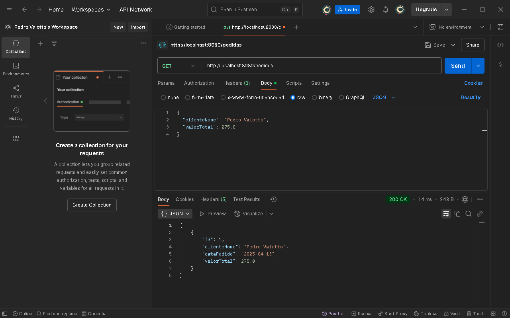

# CheckPoint1-SOA
# 📦 API de Pedidos

API desenvolvida para cadastro e gerenciamento de pedidos.

## 🚀 Endpoints

### 🔹 GET `/pedidos`
Lista todos os pedidos.

**Resposta:**

---

### 🔹 GET `/pedidos/{id}`
Busca um pedido pelo ID.

**Resposta:**

---

### 🔹 POST `/pedidos`
Cria um novo pedido.

---

### 🔹 PUT `/pedidos/{id}`
Atualiza um pedido existente.

---

### 🔹 DELETE `/pedidos/{id}`

---

## 🧪 Testes realizados

Foram realizados 5 testes usando Postman/Insomnia:

1. **Listagem de pedidos** `GET /pedidos`
2. **Criação de pedido** `POST /pedidos`
3. **Busca por ID** `GET /pedidos/{id}`
4. **Atualização de pedido** `PUT /pedidos/{id}`
5. **Exclusão de pedido** `DELETE /pedidos/{id}`

### 📷 Prints
Cole abaixo os prints de tela indicando cada um dos testes acima.

- [ ] Print 1: GET /pedidos
- [ ] Print 2: POST /pedidos
- [ ] Print 3: GET /pedidos/{id}
- [ ] Print 4: PUT /pedidos/{id}
- [ ] Print 5: DELETE /pedidos/{id}

---

## 🛠️ Tecnologias

- Java 17
- Spring Boot
- Spring Data JPA
- Jakarta Validation
- Banco de dados H2 (ou outro)

---

## 👨‍💻 Desenvolvido por
[Pedro Oliveira Valotto]

